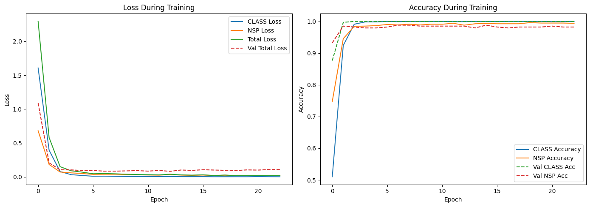
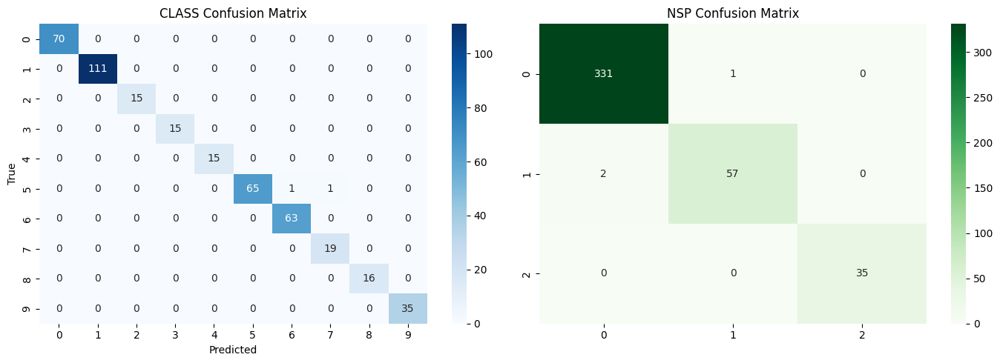
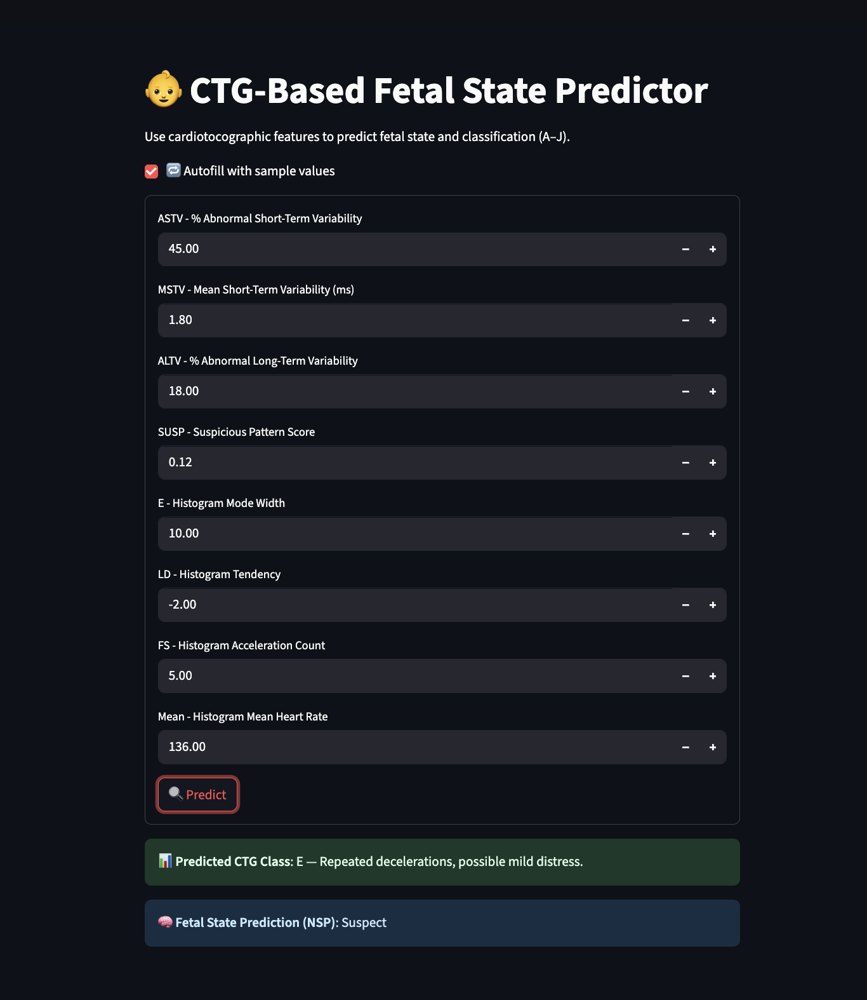

# 🤰 Fetal State Prediction from CTG Data

This project predicts fetal well-being using **Cardiotocogram (CTG)** data via a multi-output machine learning model. The model predicts:

- 🅰️ **CTG Morphological Pattern (Classes A–J)**
- 🧪 **Fetal State (Normal, Suspect, Pathologic)**

A modern **Streamlit web app** is included for interactive predictions with just 8 input features.

---

## 📂 Project Directory Structure

fetal_ctg_app/

├── app.py # Streamlit application

├── scaler.pkl # Pre-trained scaler

├── model.h5 # Trained multi-output model (CLASS & NSP)

├── README.md # Project documentation

├── data/

│ ├── CTG.xls # Raw dataset

├── assets/

│ ├── accuracy_plot.png # Accuracy visualization

│ ├── confusion_matrix.png# Confusion matrix

│ ├── ctg_architecture.png# Model architecture diagram (optional)


---

## 🧠 Model Overview

| Task        | Output Type | Classes                                | Accuracy |
|-------------|-------------|-----------------------------------------|----------|
| **CLASS**   | Multi-class | A, B, C, D, E, F, G, H, I, J            | ✅ **99.77%** |
| **NSP**     | Multi-class | Normal (1), Suspect (2), Pathologic (3) | ✅ **98.83%** |

> ✅ Both outputs are learned using **multi-task deep learning** with shared input layers and separate heads.

---

## 📈 Results

### ✅ Test Accuracy



- **CLASS prediction:** `99.77%`
- **NSP prediction:** `98.83%`

---

### 🔍 Confusion Matrix



- Balanced performance across all classes
- Low misclassification rate

---

## 🧪 Features Used

Only **8 most important features** were used in the app:

| Feature | Description |
|---------|-------------|
| `SUSP`  | Suspicious pattern count |
| `MSTV`  | Mean short-term variability |
| `E`     | Histogram Mode Width |
| `LD`    | Histogram Tendency |
| `ASTV`  | % abnormal short-term variability |
| `Mean`  | Histogram mean fetal heart rate |
| `FS`    | Acceleration histogram count |
| `ALTV`  | % abnormal long-term variability |

---

## 🚀 Streamlit App

## Demo




### ▶️ Launch locally

```bash
streamlit run app.py
```

## 🌟 Features
Autofill button for test inputs

Human-readable predictions with class descriptions

Beautiful UI with gradient and card-based layout

## 📊 Model Training
Preprocessing via StandardScaler

Multi-output Keras model with softmax heads

Trained on 2126 samples, validated on holdout test set


## 💡 Future Enhancements
✅ SHAP explainability for real-time feedback

📤 Deploy via Streamlit Cloud

📲 Mobile-friendly UI

## 📜 License
MIT License. Use freely and cite if helpful.


### 🙋‍♂️ Author
 Mohammed Yousuf
AI Engineering Student | Passionate about Machine Learning, Computer Vision, and Real-World Applications 🚀
Feel free to reach out or contribute!
### 📄 License
This project is licensed under the MIT License.
### 🌟 Star this repository
If you found this helpful, give it a ⭐ on GitHub!
